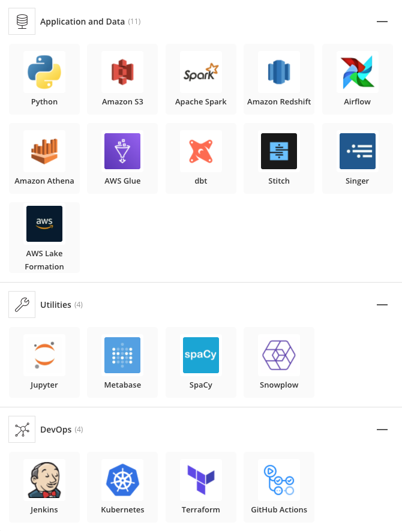

# Data Analyst at Onefootball

The appetite for Data and Analytics is still booming across all industries. Yet, when it comes to `data roles` a clear standard is missing. Naming, roles and responsibilities can significantly differ amongst companies. This page is our way to make it hopefully more clear to you what the `Data Analyst` role is about.

## What is the difference between Data Analyst & Data Scientist?

Data analysts approach raw data from different angles and use analytical methods to inform business decisions. At OneFootball we manage a data lake architecture that lets us combine different source data to create an *Enterprise Dimensional Model* (EDM) that helps describe our business across different entities (Teams, Articles, Push Notifications, etc.) that we operate. As a data analyst your key contribution is to add, enrich and maintain our EDM by using a lot of the best practices from [Analytics Engineering](https://blog.getdbt.com/building-a-mature-analytics-workflow/).

In contrast to that, many applicants confuse that data science at its heart is quite different. In fact, it is applied research, that combines statistics, data and software engineering skills to deliver data products on a machine level. Such machine learning (ML) projects need data as much as our EDM, however, those demand a lot of know-how that go beyond the scope of an analyst.

Computing metrics accurately and communicating insights properly is a competency that we value highly at OneFootball. The challenge we are take up as analyst at OneFootball is to make our data:

* easy to find
* easy to understand &
* actionable

This allows us to make effective decision-making for the business, which is at the core of an analyst's responsibility at OneFootball. 

## How do I prepare for my interview process?

* OneFootball is a customer-centric product that was mobile-first. Make sure you [download the app](https://app.adjust.com/w5wy2cu_c6h01fk?campaign=data-analyst) and identify key value propositions we have. You might find some of the information on our company [website](https://company.onefootball.com/about) useful
* Make sure you understand for which area of the business you are applying. Data analysts at OneFootball always dedicate their time to specific strategic context or a to a key business function
* Your key contribution will be to inform decisions in order to create business value. What do you think is the business model behind OneFootball and how do we measure success? 
* When it comes to your previous experience so far we want to know how you contributed to the growth and success of a business.

## What data stack do you run at OneFootball?

